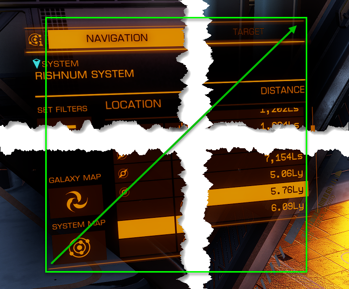

# EDAPGui Calibration
This document explains how to perform calibration for the
Elite Dangerous Autopilot (GUI) version. 
Calibration is performed from the Calibration tab:


## Region Calibration
This performs calibration of certain regions of the screen that may change bsed on resolution and FOV settings. It may be required to recalibrate if either of these settings change.


The process is generally the same for each region:
1. Select a region from the dropdown list. The region will be highlighted on the screen.
2. Review the procedure which explains the process. It may be that the highlighted region is already correct. If the procedure states 'Do not change', then the region is read only, it will automatically be calculated when **Save All Calibrations** is clicked.
3. Follow the pictures below, if unsure of the instructions.
4. Click the **Calibrate Region** button.
5. The current region will be highlighted in green.
6. Left click and drag with the mouse to select a new region. It will be highlighted blue. Release the mouse button to complete the selection. To cancel selection, right click the mouse.
7. Click **Save All Calibrations** and select the region again in the dropdown list to check the region is correct. Repeat until correct.

To further aid calibration, the following give examples of the correct region. Note that in the examples below, some additional space was added to make it easier to see where the region is. Try to get as close as possible to the line, without going over.

### Codex
1. Open the Codex from right hand cockpit panel.
2. Draw a rectangle from the top left corner of the codex 'book' to the end of the line above the exit button at the bottom right.


### Commodities Market
NOTE: This is calculated from the Codex screen. It is included as a verification that the calculated region is correct.
1. When docked, open Station Services and then the Commodities Market.
2. TBD.

### Galaxy Map
NOTE: This is calculated from the Codex screen. It is included as a verification that the calculated region is correct.
1. Open Galaxy Map.
2. The rectangle should extend from the top left corner of the cartographics logo to the right of the right hand map icons and the bottom of the route box at the bottom.


### System Map
NOTE: This is calculated from the Codex screen. It is included as a verification that the calculated region is correct.
1. Open System Map.
2. The rectangle should extend from the top left corner of the cartographics logo to the right of the right hand map icons and the bottom of the route box at the bottom.


### Station Services
1. Open Station Services.
2. Draw a rectangle from the top left corner of the left panel to the bottom right of the right panel, above the line that sits above the exit button.


### Navigation Panel
Note: Appears the Nav Panel changes per ship, so increase the region for each new ship and eventually all ships will be covered. It should work out okay and will prevent having to redo every time you switch ships.
1. Open Navigation Panel.
2. Draw a rectangle from the top left corner of the nav panel to the bottom right corner.




### Status Panel
Note: Appears the Nav Panel changes per ship, so increase the region for each new ship and eventually all ships will be covered. It should work out okay and will prevent having to redo every time you switch ships.
1. Open Internal Status Panel (right hand panel).
2. Draw a rectangle from the top left corner of the nav panel to the bottom right corner.


## Compass and Target Calibration

This document explains how to perform calibration for the Elite Dangerous Autopilot (GUI) version.  You will need to perform this calibration step if the behavior of EDAPGui on your system is endless Pitching up when activating the FSD Assist.  For some user systems this calibration is needed to determine the proper scaling value for the images in the template directory.  These are dependant on screen/game resolution.   The template images were created on a 3440x1440 resolution monitor and require scaling for other target computers.


## Compass Calibration
Not all ships have the same size compass, so it is necessary to calibrate the compass of each of your ships to take into account the resolution of the screen and FOV. Once saved, the correct scaling will automatically be loaded when changing ships.

## Target Calibration
A configuration file called _config-resolution.json_ contains standard Screen resolution and scaling values. The calibration sequence below will store the scaling configuration in the settings file AP.json. Otherwise it will look for another entry that matches the users screen resolution. This calibration exercise should only need to be done once on your system.  

# Process
The calibration algorithm will try matching the template images to your ED screen by looping through scaling factors and 
picking the most optimal scale based on the match percentage.<br>
``` Note: No commands will be sent to ED during this calibration, it will simply be performing screen grabs. ```

Also see:  HOWTO-RollPitchYaw.md on how to adjust your autopilot performance while maneuvering to target.

# Setup
* Start Elite Dangerous (ED)
* Set the ED configuration to be
    * In Supercruise (%0 thrust is ok)
    * Target system selected
    * Align to the target, as show in this screenshot:<br>


# To run the calibration (Target or Compass)
* Start EDAPGui
* Under the File menu, click 'Calibrate Target' or 'Calibrate Compass'
* Select OK from the popup
  * A blue boxes appears, either around the compass or around the center of the screen
  * Ensure that the compass/target are visible within these areas
  * The calibration will likely take less than 1 minute
  * A red box will appear in the blue box and will attempt to find matching images. When a match is found, a green box will appear over the match. This is the best match found so far
  * The process is repeated a number of times with different matching thresholds. The green box will always indicate the best match and should be located around the compass and target
  * The match percentabe (0.0 to 1.0) is shown above the green box. A match of > 0.5 for both compass and target is required for success
  * The GUI Window will show the results 
    * Also you can open config-resolution.json to see the selected scaling values for the 'Calibrated' key
* Restart EDAPGui after this process to ensure picking up the correct scaling values
